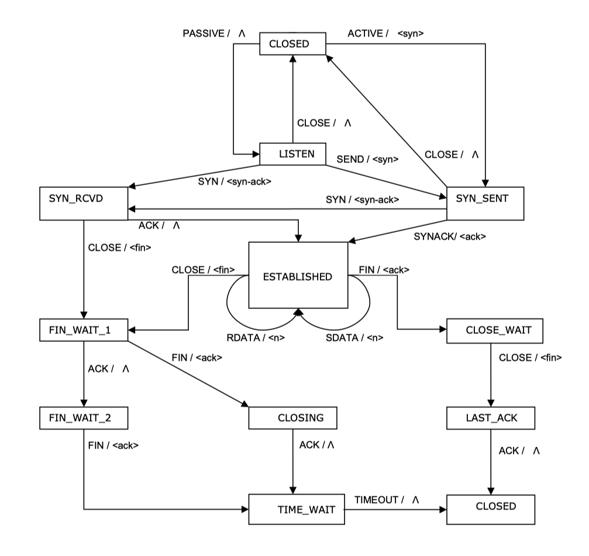

# Simple Finite State Machine Implementation of TCP
Author Name: Shiwei He
Course: FA23_CSCI-GA_2262_1_001 Data Communication & Networks

## Directory specification
1. Main Class
TCP class is the main class, and main function is the entry point of the whole program.

2. Nested Classes
The FSM, Event, and Action classes are nested within TCP. 

3. Top-Level Classes

### Figure 1 - TCP Connection Protocol

